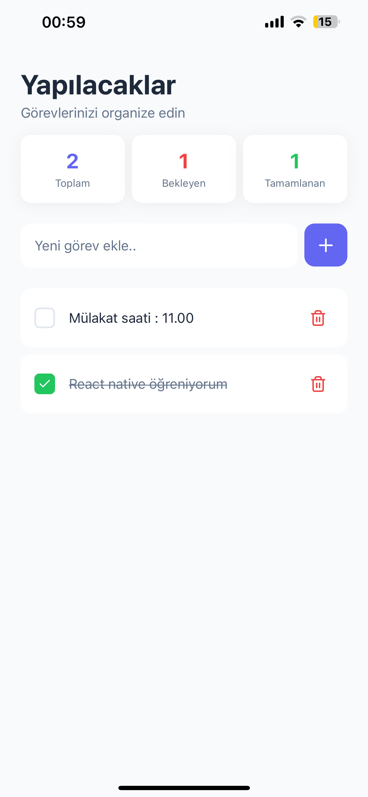
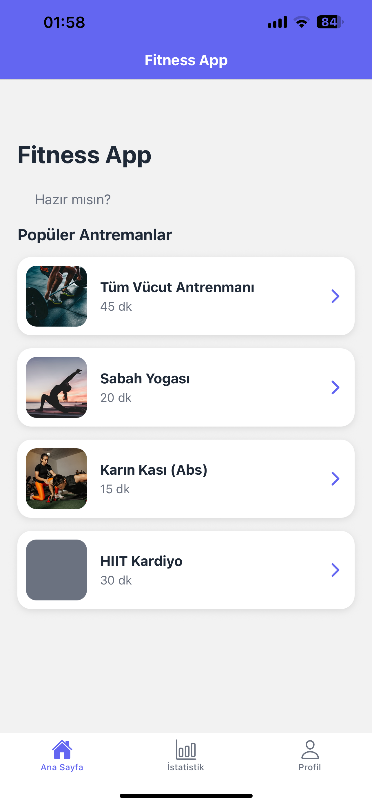
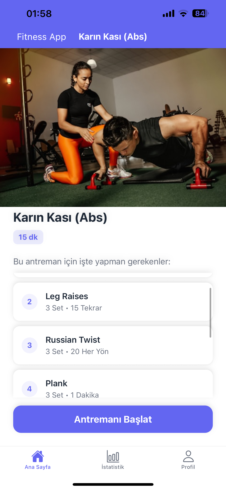
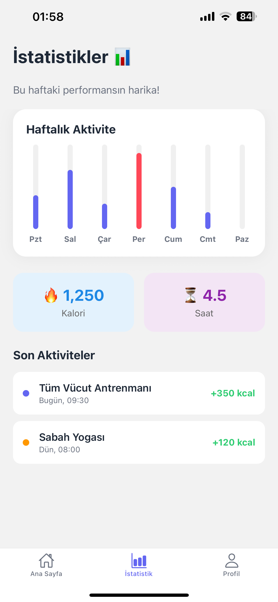
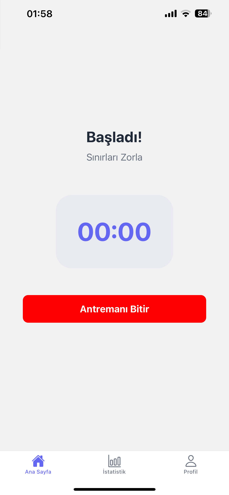
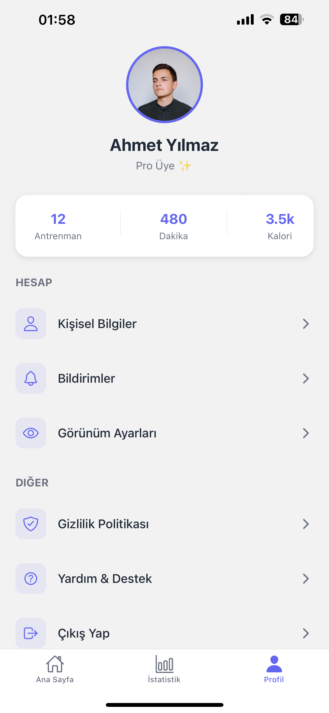

# React-Native-Journey
React Native roadmap: Building mobile applications from scratch, exploring hooks, storage, and navigation.

---

### 01. Counter App
* **Kullanılanlar:** `useState`, `StyleSheet`, `TouchableOpacity`.
* **İşlev:** Temel state yönetimi ve buton etkileşimleri.
* **Görünüm:**


---

### 02. Todo App
* **Kullanılanlar:** `FlatList`, `TextInput`, `Modal`, `KeyboardAvoidingView`.
* **İşlev:** Dinamik liste yönetimi, veri ekleme ve silme işlemleri.
* **Görünüm:**


---

### 03. Fitness App
* **Kullanılanlar:** `React Navigation (Stack & Tabs)`, `Custom Components`, `Props`, `ImageBackground`.
* **İşlev:** Çoklu ekran yapısı, ekranlar arası veri aktarımı ve gelişmiş UI düzeni.
* **Görünüm:**

| Ana Ekran | Detay Ekranı | Gelişim Takip Ekranı | Aktif Antrenman | Profil |
| :---: | :---: | :---: | :---: | :---: |
|  |  |   |  | 

---

## Kurulum
Herhangi bir projeyi çalıştırmak için ilgili klasöre girip aşağıdaki komutları uygulayın:

```bash
# Proje klasörüne girin
cd 03-FitnessApp

# Bağımlılıkları yükleyin
npm install

# Projeyi başlatın
npx expo start
